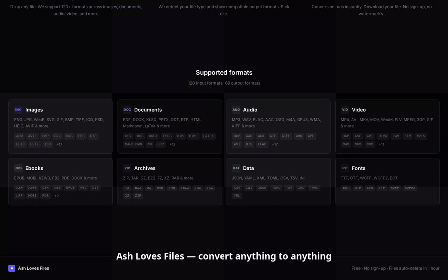
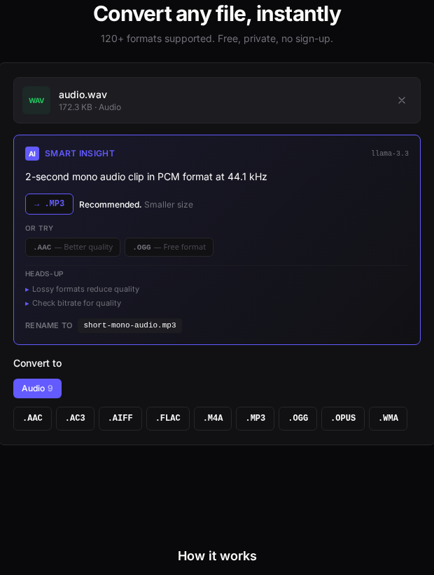

<div align="center">

# ALF — Ash Loves Files

**A universal file converter supporting 120+ formats across 8 categories**

[](https://frontend-production-2bfcc.up.railway.app)
[](https://nextjs.org)
[](https://fastapi.tiangolo.com)
[](https://python.org)
[](https://docker.com)
[](LICENSE)

*Free · Private · No sign-up required · Files auto-deleted after 1 hour*

</div>

---

## Demo

<div align="center">



<sub>21 real conversions across all 8 categories — each preceded by a live AI content summary and format recommendation. <a href="docs/demo.mp4">Download the full captioned MP4</a> (7 MB, 4 min).</sub>

</div>

## AI Insights

Every upload is analysed by Llama 3.3 (Groq) before you pick a format. The assistant reads the file, summarises what it contains, and recommends the output format that best fits your likely use case — with a one-line reason and alternatives you can pick with one click.

<div align="center">
  
</div>

The card surfaces five things per file:

- **Content summary** — PDF page count, audio bitrate, EPUB title, zip manifest, font glyph count, image EXIF
- **Recommended format** with a ≤14-word justification (the big CTA button)
- **Alternatives** — two ranked fallbacks, each with their own reason
- **Heads-up tips** — format-specific gotchas ("TIFF → JPG loses transparency", "Low-bitrate audio won't improve on re-encode")
- **Suggested filename** — a content-aware kebab-case rename for your output

Set `GROQ_API_KEY` in `backend/.env` (free tier at https://console.groq.com) to enable it.

---

## Overview

Convert any file instantly in the browser. Upload a file, pick an output format, and download the result — no account, no watermark, no upload limits beyond 100 MB. All conversion tools (FFmpeg, LibreOffice, Pandoc, ImageMagick, Calibre) are bundled inside Docker so deployment requires nothing but `docker compose up`.

---

## Supported Formats

### Image
| | Formats |
|---|---|
| **Input** | png, jpg, gif, bmp, tiff, webp, ico, psd, pcx, tga, ppm, pgm, pbm, heic, heif, avif, svg, eps, raw, cr2, nef, arw, dng, orf, rw2 |
| **Output** | png, jpg, gif, bmp, tiff, webp, ico, pdf, eps, pcx, tga, ppm |

### Document
| | Formats |
|---|---|
| **Input** | pdf, docx, doc, xlsx, xls, pptx, ppt, odt, ods, odp, rtf, txt, html, md, csv, tsv, tex, epub, xml |
| **Output** | pdf, docx, xlsx, pptx, odt, ods, odp, rtf, txt, html, csv, md, epub, tex |

### Audio
| | Formats |
|---|---|
| **Input** | mp3, wav, flac, aac, ogg, wma, m4a, aiff, opus, amr, ac3, dts, ape, mid |
| **Output** | mp3, wav, flac, aac, ogg, m4a, aiff, opus, ac3, wma |

### Video
| | Formats |
|---|---|
| **Input** | mp4, avi, mkv, mov, wmv, flv, webm, mpeg, 3gp, m4v, vob, ts, mts, ogv, asf, rm |
| **Output** | mp4, avi, mkv, mov, webm, gif, mpeg, 3gp, m4v, ts, flv, ogv |

### Ebook
| | Formats |
|---|---|
| **Input** | epub, mobi, azw3, azw, fb2, lit, pdb, lrf, cbz, cbr |
| **Output** | epub, mobi, azw3, fb2, pdf, txt, html, docx, rtf |

### Archive
| | Formats |
|---|---|
| **Input** | zip, tar, gz, tgz, bz2, tbz2, xz, 7z, rar |
| **Output** | zip, tar, gz, tgz, bz2, xz, 7z |

### Data
| | Formats |
|---|---|
| **Input / Output** | json, yaml, toml, xml, csv, tsv, ini |

### Font
| | Formats |
|---|---|
| **Input** | ttf, otf, woff, woff2, eot, svg |
| **Output** | ttf, otf, woff, woff2 |

---

## Tech Stack

### Frontend


### Backend


### Conversion Tools

| Category | Tool | Version |
|----------|------|---------|
| Images | Pillow | 10.4.0 |
| Images (advanced) | Wand / ImageMagick | 0.6.13 |
| Audio / Video | FFmpeg + ffmpeg-python | 0.2.0 |
| Office docs | python-pptx | 1.0.2 |
| Word docs | python-docx | 1.1.2 |
| Spreadsheets | openpyxl | 3.1.5 |
| PDF | PyPDF + WeasyPrint + PyMuPDF + pdf2docx | 4.3.1 / 62.3 / 1.24 / 0.5.8 |
| Ebooks | Calibre (`ebook-convert`) | CLI |
| Archives | py7zr | 0.22.0 |
| Data formats | PyYAML · toml · xmltodict | 6.0.2 / 0.10.2 / 0.13.0 |
| Fonts | fontTools + Brotli + Zopfli | 4.54.1 |
| AI insights | Groq (Llama 3.3 70B) | 1.2.0 |

### Infrastructure


---

## Getting Started

### Prerequisites

- [Docker](https://docs.docker.com/get-docker/) and Docker Compose

### Run with Docker (recommended)

```bash
git clone https://github.com/ARSHIYASHAFIZADE/ALF.git
cd ALF
cp .env.example .env
make dev
```

| URL | Service |
|-----|---------|
| http://localhost:3000 | Frontend |
| http://localhost:8000 | Backend API |
| http://localhost:8000/docs | Swagger UI |

### Make Commands

```bash
make dev          # Start with live logs
make up           # Start in background
make down         # Stop all services
make logs         # Stream all logs
make logs-backend # Backend logs only
make clean        # Stop and remove volumes
```

### Local Development (without Docker)

> Requires Redis, FFmpeg, LibreOffice, Pandoc, and Calibre installed locally.

```bash
# Backend
cd backend
pip install -r requirements.txt
uvicorn app.main:app --reload --port 8000

# Worker (separate terminal)
celery -A app.tasks worker --loglevel=info --concurrency=2

# Frontend (separate terminal)
cd frontend
npm install
npm run dev
```

---

## Environment Variables

Copy `.env.example` to `.env`:

```env
# Backend
REDIS_URL=redis://redis:6379/0
DATABASE_URL=sqlite+aiosqlite:///./data/ash.db
UPLOAD_DIR=/data/uploads
OUTPUT_DIR=/data/outputs
MAX_UPLOAD_SIZE_MB=100
ALLOWED_ORIGINS=http://localhost:3000
RATE_LIMIT_PER_MINUTE=20
CLEANUP_AFTER_HOURS=1

# Frontend
NEXT_PUBLIC_API_URL=http://localhost:8000
```

---

## API Reference

### Upload & Convert

| Method | Endpoint | Description |
|--------|----------|-------------|
| `POST` | `/api/upload` | Upload file + select output format |
| `POST` | `/api/convert/{job_id}` | Start conversion |
| `GET` | `/api/job/{job_id}` | Poll job status and progress |
| `GET` | `/api/download/{job_id}` | Download converted file |

### AI

| Method | Endpoint | Description |
|--------|----------|-------------|
| `POST` | `/api/ai/analyze-upload` | Inspect a file without creating a job — returns summary, recommended format, alternatives, tips, suggested filename |
| `POST` | `/api/ai/analyze/{job_id}` | Same analysis for an already-uploaded job |

### Formats

| Method | Endpoint | Description |
|--------|----------|-------------|
| `GET` | `/api/formats` | All formats grouped by category |
| `GET` | `/api/formats/{input_format}` | Output formats for a given input |
| `GET` | `/api/formats-list` | Flat lists of all input/output formats |

### Health

| Method | Endpoint | Description |
|--------|----------|-------------|
| `GET` | `/health` | Health check |

Full interactive docs at `/docs` (Swagger) when the backend is running.

---

## Project Structure

```
ALF/
├── frontend/                    # Next.js app
│   ├── src/
│   │   ├── app/
│   │   │   ├── layout.tsx       # Root layout + metadata
│   │   │   ├── page.tsx         # Main converter page
│   │   │   └── globals.css      # Global styles + theme
│   │   ├── components/
│   │   │   ├── Header.tsx
│   │   │   ├── UploadZone.tsx   # Drag-and-drop upload
│   │   │   ├── FormatPicker.tsx # Category tabs + format selection
│   │   │   ├── ConversionProgress.tsx
│   │   │   ├── FormatExplorer.tsx
│   │   │   ├── HowItWorks.tsx
│   │   │   └── Footer.tsx
│   │   └── lib/
│   │       ├── api.ts           # API client
│   │       └── formats.ts       # Format metadata
│   └── Dockerfile
│
├── backend/                     # FastAPI app
│   ├── app/
│   │   ├── main.py              # App setup + CORS + routes
│   │   ├── config.py            # Settings / env
│   │   ├── models.py            # ConversionJob SQLAlchemy model
│   │   ├── converters/
│   │   │   ├── base.py          # BaseConverter abstract class
│   │   │   ├── registry.py      # Auto-discovery registry
│   │   │   ├── image.py
│   │   │   ├── document.py
│   │   │   ├── audio_video.py
│   │   │   ├── archive.py
│   │   │   ├── data.py
│   │   │   ├── ebook.py
│   │   │   └── font.py
│   │   └── routers/
│   │       ├── upload.py
│   │       ├── convert.py
│   │       └── formats.py
│   ├── requirements.txt
│   └── Dockerfile
│
├── docker-compose.yml           # 4 services: api, worker, redis, frontend
├── Makefile
└── .env.example
```

---

## How It Works

1. **Upload** — file sent to `/api/upload`, saved to disk, `ConversionJob` record created in SQLite
2. **Convert** — `/api/convert/{job_id}` runs the converter in a thread pool with real-time progress updates
3. **Poll** — frontend polls `/api/job/{job_id}` until `completed` or `failed`
4. **Download** — `/api/download/{job_id}` streams the output file back
5. **Cleanup** — files auto-deleted after 1 hour

Adding a new format: create a class inheriting `BaseConverter`, register it in `ConversionRegistry` — nothing else changes.

---

## License

MIT

---

<div align="center">

*Built with Next.js · FastAPI · Celery · Redis · Docker*

[](https://github.com/ARSHIYASHAFIZADE)
[](https://frontend-production-2bfcc.up.railway.app)

</div>
